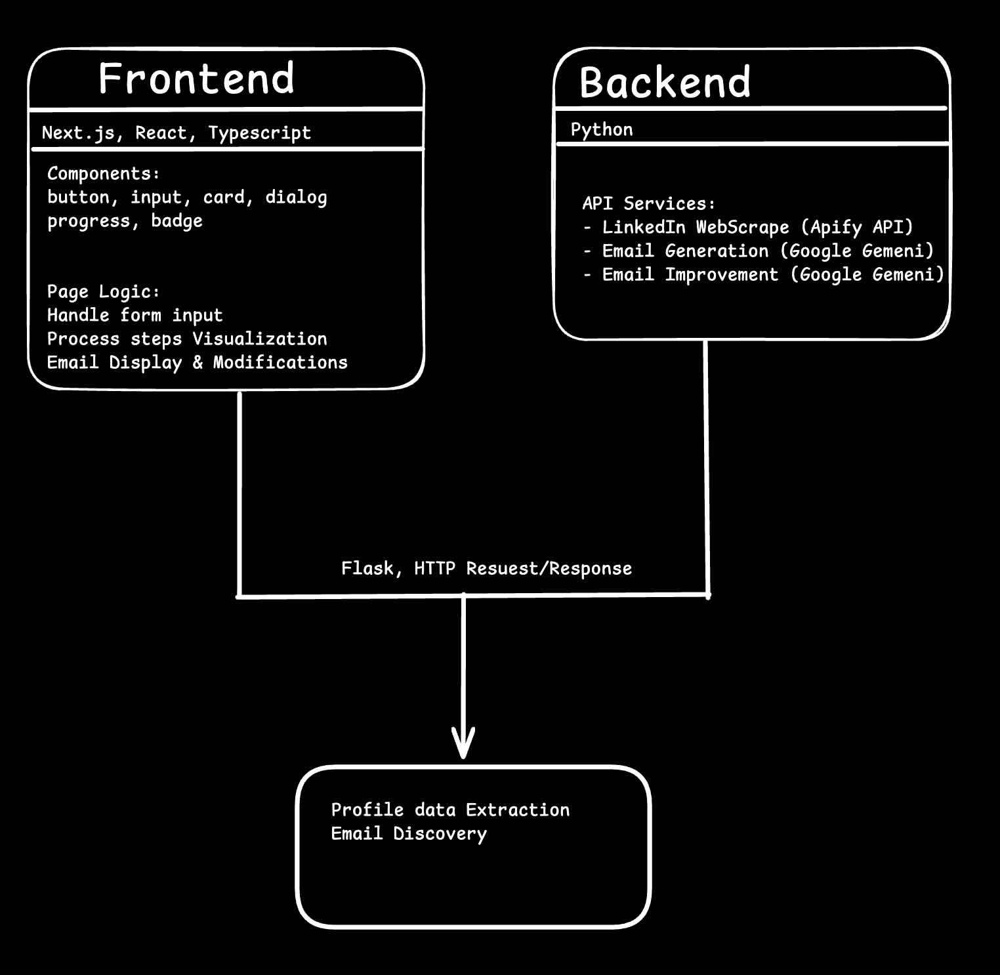

This is a README that is isn't build by vibe coding, so it might be janky but should work.

## How It Works

### System Architecture

### Application Demo
Watch our demo video to see LeadHunter in action:

### Setup Instructions

STEP 1: Create 2 terminals, and copy-paste these commands

[Terminal 1]: Install dependencies:

    cd frontend
    npm install

[Terminal 2]: Install virtual environment & dependencies:

    cd backend
    python -m venv venv
    source venv/bin/activate
    pip install -r requirements.txt

STEP 2: 
[Terminal 3]: Create a .env file in the directory where frontend and backend are located:

    touch .env
    
Get your API keys (put these into the .env file):

    APIFY_API_TOKEN=xxxx
    APIFY_USER_ID=xxxx
    GEMINI_API_KEY=xxxx

STEP 4: Get your API keys (paste these in a browser):

APIFY_USER_ID=xxxx
APIFY_API_TOKEN=xxxx

    https://console.apify.com/sign-up

GEMINI_API_KEY=xxxx

    https://aistudio.google.com/app/apikey
    
    

[Terminal 1] run frontend:

    npm run dev

[Terminal 2] run backend:

    python app.py

[Terminal 3] can just chill :D
    

### Fun Facts

We won 2nd place in this hackathon:
https://ai-agents-hackathon-gtc.devpost.com/?_gl=1*l8urn7*_gcl_au*ODk5NjQyNTczLjE3NDAyNjMzNDM.*_ga*ODkyNzA3NzUwLjE3NDAyNjMzNDM.*_ga_0YHJK3Y10M*MTc0Mjc1MzIyMS42LjEuMTc0Mjc1MzIzOS4wLjAuMA..

The guy who won first place was a founding engineer at Figma, awesome guy btw, but this project didn't stand a chance against such a cracked fellow
